# Understanding and Building Large Language Models (LLMs)

This project aims to provide a comprehensive understanding of Large Language Models (LLMs) and implement one from scratch. It serves as both a detailed technical reference and a practical implementation guide. The repository contains:

1. **Detailed Documentation**: A thorough explanation of transformer architecture, tokenization, embeddings, attention mechanisms, and training methodologies
2. **Implementation Code**: From-scratch implementations of all core LLM components
3. **Visualization Tools**: Interactive web interface for exploring model internals and understanding how transformers process text
4. **Training Pipeline**: Tools for training custom models on specific datasets
5. **Benchmarking Suite**: Standardized evaluation frameworks to assess model capabilities

This document explains the theoretical foundations of LLMs in detail, with diagrams illustrating the architecture and data flow. For implementation details, see the corresponding code in the `src` directory. If you encounter unfamiliar terms, please refer to our [Glossary](Glossary.md) for definitions.


## 1. Foundations: The Transformer Architecture

### 1.1 The Revolutionary "Attention is All You Need" Paper

In 2017, researchers at Google Brain published a groundbreaking paper titled "Attention is All You Need," which introduced the Transformer architecture. Before this, most sequence-to-sequence models relied on recurrent neural networks (RNNs) like LSTMs or GRUs, which processed text sequentially, word by word. This sequential nature created bottlenecks:

1. **Sequential processing** made parallelization difficult
2. **Long-range dependencies** were hard to capture due to the vanishing gradient problem
3. **Training was slow** and computationally expensive

The key innovation of the paper was replacing recurrence entirely with a mechanism called "attention," allowing the model to directly connect any words in a sequence, regardless of their distance from each other. This enabled parallel processing and better handling of long-range dependencies.

### 1.2 Detailed Transformer Architecture

The original Transformer is an encoder-decoder architecture designed for sequence-to-sequence tasks like translation. Here's a detailed breakdown:

```mermaid
graph TD
    classDef embedding fill:#f9d5e5,stroke:#333,stroke-width:1px
    classDef attention fill:#eeac99,stroke:#333,stroke-width:1px
    classDef feedforward fill:#e06377,stroke:#333,stroke-width:1px
    classDef normalization fill:#c83349,stroke:#333,stroke-width:1px
    
    Input[Input Sequence] --> TokenEmbed[Token Embeddings]
    TokenEmbed --> PosEnc[Positional Encoding]
    
    subgraph "Encoder Stack (Nx)"
        PosEnc --> EncStack[Encoder Stack]
        
        subgraph "Single Encoder Block"
            EncIn[Input] --> EncMHA[Multi-Head Attention]
            EncMHA --> EncAddNorm1[Add & Normalize]
            EncAddNorm1 --> EncFF[Feed Forward Network]
            EncFF --> EncAddNorm2[Add & Normalize]
            EncAddNorm2 --> EncOut[Output]
        end
    end
    
    subgraph "Decoder Stack (Nx)"
        DecoderInput[Decoder Input] --> DecStack[Decoder Stack]
        EncOut --> DecStack
        
        subgraph "Single Decoder Block"
            DecIn[Input] --> DecMSA[Masked Multi-Head Attention]
            DecMSA --> DecAddNorm1[Add & Normalize]
            DecAddNorm1 --> DecCrossAttn[Cross-Attention with Encoder]
            DecCrossAttn --> DecAddNorm2[Add & Normalize]
            DecAddNorm2 --> DecFF[Feed Forward Network]
            DecFF --> DecAddNorm3[Add & Normalize]
            DecAddNorm3 --> DecOut[Output]
        end
    end
    
    DecOut --> Linear[Linear Layer]
    Linear --> Softmax[Softmax]
    Softmax --> Output[Output Probabilities]
    
    class TokenEmbed,PosEnc embedding
    class EncMHA,DecMSA,DecCrossAttn attention
    class EncFF,DecFF feedforward
    class EncAddNorm1,EncAddNorm2,DecAddNorm1,DecAddNorm2,DecAddNorm3 normalization
```



#### 1.2.1 The Input Processing Pipeline

Before any sequence enters the Transformer architecture, it undergoes three key processes:

1. **Tokenization**: Breaking text into tokens (more on this in section 2)
2. **Token Embedding**: Converting tokens to vectors (dimension *d_model*, typically 512-1024)
3. **Positional Encoding**: Adding positional information

The positional encoding is crucial because, unlike RNNs, Transformers process all tokens simultaneously, losing the natural order of the sequence. Positional encoding adds this information back:


Where:
- *pos* is the position of the token in the sequence
- *i* is the dimension within the embedding vector
- *d_model* is the embedding dimension (e.g., 512)

This creates a unique pattern for each position that the model can learn to interpret.

#### 1.2.2 Encoder Block in Detail

Each encoder block contains two main sublayers:

##### Multi-Head Attention

This is the heart of the Transformer. Attention allows the model to focus on relevant parts of the input sequence when producing an output. 


The attention mechanism is defined by the formula:

$$\text{Attention}(Q, K, V) = \text{softmax}\left(\frac{QK^T}{\sqrt{d_k}}\right)V$$

Where:
- **Q (Query)**: Represents what we're looking for
- **K (Key)**: Represents what we have (potential matches)
- **V (Value)**: Represents what we want to retrieve
- **√dk**: Scaling factor (dimension of keys) to prevent vanished gradients

In a self-attention layer, Q, K, and V all come from the same source (the previous layer).

The "multi-head" part means running multiple attention operations in parallel, with each head potentially focusing on different aspects of the relationship between tokens. This is analogous to having multiple "representation subspaces."

##### Feed-Forward Network

After attention, each position is processed by a simple feed-forward network:

$$\text{FFN}(x) = \max(0, xW_1 + b_1)W_2 + b_2$$

This is a two-layer neural network with a ReLU activation in between, applied identically to each position.

##### Residual Connections and Layer Normalization

Both sublayers employ:
1. **Residual connection**: Adding the input to the sublayer output (helps with gradient flow)
2. **Layer normalization**: Normalizing the outputs to have mean 0 and variance 1 (stabilizes training)

The complete formula for each sublayer is:
$$\text{LayerNorm}(x + \text{Sublayer}(x))$$

#### 1.2.3 Decoder Block in Detail

The decoder has three sublayers:

1. **Masked Multi-Head Attention**: Like the encoder's attention, but with masking to prevent attending to future tokens (critical for autoregressive generation)
2. **Cross-Attention**: Attends to the encoder's output, allowing the decoder to focus on relevant parts of the input when generating each output token
3. **Feed-Forward Network**: Identical to the encoder's FFN

The masking in the first sublayer is crucial for training. Since the decoder predicts the next token based on previous ones, we must prevent it from "cheating" by looking at future tokens. This is done by setting future positions to negative infinity before the softmax, effectively zeroing them out.

### 1.3 Modern Variants: Encoder-Only, Decoder-Only, and Encoder-Decoder

The original Transformer architecture has evolved into three main variants:


#### 1.3.1 Encoder-Only Models (e.g., BERT)

Encoder-only models are bidirectional, meaning they can see the entire input context at once. They excel at understanding tasks:
- Text classification
- Named entity recognition
- Question answering
- Semantic understanding

#### 1.3.2 Decoder-Only Models (e.g., GPT, Claude, o1)

Decoder-only models are unidirectional/autoregressive, generating one token at a time based on previous tokens. They excel at generation tasks:
- Text completion
- Chatbots
- Creative writing
- Code generation

Modern LLMs like GPT-4, Claude-3.7, DeepSeek R1, and o1 are all decoder-only architectures, though with various proprietary modifications.


#### 1.3.3 Encoder-Decoder Models (e.g., T5, BART)

These most closely resemble the original Transformer and are designed for sequence-to-sequence tasks:
- Machine translation
- Summarization
- Generative question answering

## 2. Tokenization: The Foundation of Language Processing

Tokenization is the first step in processing text for an LLM. It involves breaking text into smaller units called tokens.

### 2.1 Types of Tokenization


#### 2.1.1 Character-Level Tokenization

- **Pros**: No out-of-vocabulary (OOV) issues, small vocabulary
- **Cons**: Long sequences, loses semantic meaning of words
- **Example**: "hello" → ['h', 'e', 'l', 'l', 'o']

#### 2.1.2 Word-Level Tokenization

- **Pros**: Preserves semantic units, shorter sequences
- **Cons**: Large vocabulary, OOV issues, can't handle spelling errors
- **Example**: "The quick brown fox" → ['The', 'quick', 'brown', 'fox']

#### 2.1.3 Subword Tokenization (Used in Modern LLMs)

- **Pros**: Balance between character and word levels, handles rare words and morphology
- **Cons**: More complex algorithms, segmentation errors
- **Example**: "unbelievable" → ['un', 'believe', 'able']

### 2.2 Modern Tokenization Algorithms

#### 2.2.1 Byte-Pair Encoding (BPE)

BPE is an iterative algorithm that starts with individual characters and merges the most common pairs:


BPE is used in GPT models and creates a vocabulary of subwords that balances compression and semantic meaning.

#### 2.2.2 WordPiece (BERT)

Similar to BPE, but uses a different merging criterion based on likelihood rather than frequency.

#### 2.2.3 SentencePiece

Treats the text as a sequence of Unicode characters and applies BPE or unigram language modeling. Important because it's completely language-agnostic and works for any language.

### 2.3 The Tokenization Process in Practice


Modern tokenizers include special tokens:
- `[CLS]`: Start of sequence token
- `[SEP]`: Separator token
- `[PAD]`: Padding token
- `[MASK]`: Masked token (for BERT-style models)
- `[BOS]`, `[EOS]`: Beginning/end of sequence
- `[UNK]`: Unknown token for OOV words

## 3. Word Embeddings: From Tokens to Vectors

Embeddings convert discrete tokens into continuous vector representations that capture semantic meaning.

### 3.1 The Evolution of Word Embeddings


### 3.2 How Embeddings Work

In the context of Transformers, each token ID is mapped to a vector of dimension `d_model` (typically 768 in BERT-base or 1024 in larger models). These embeddings are learned during training and encode semantic relationships between words.


After embedding, semantically similar words are close to each other in the vector space. For example, 'cat' and 'kitten' would be closer to each other than 'cat' and 'democracy'.

### 3.3 Positional Embeddings

In the original Transformer, positional information was added using sine and cosine functions. Modern models often use learned positional embeddings instead, which are added directly to the token embeddings:


### 3.4 Types of Modern Embeddings

#### 3.4.1 Absolute Positional Embeddings
A unique vector for each position up to a maximum sequence length.

#### 3.4.2 Relative Positional Embeddings (RPE)
Encodes relative distance between tokens rather than absolute positions. Used in transformers like T5 and improved models.

#### 3.4.3 Rotary Position Embeddings (RoPE)
Used in models like GPT-NeoX and newer GPT variants, applies a rotation to the embedding space based on position. Better handles extrapolation to longer sequences.

### 3.5 Parameters, Weights, and the Embedding Matrix

#### 3.5.1 What Are Model Parameters?
Parameters in a language model are the learnable values that are adjusted during training to optimize the model's performance. These include:

- **Weights**: Values in dense or convolutional layers that determine how inputs are transformed
- **Biases**: Offset values added to the output of a layer
- **Embedding matrices**: Special weight matrices that convert tokens to vectors

When we refer to a model's "size" (e.g., "GPT-3 has 175 billion parameters"), we're counting the total number of these learnable values. The parameter count is a key factor in a model's capability and computational requirements.


#### 3.5.2 Weights vs. Parameters
While often used interchangeably, there's a subtle distinction:

- **Parameters** is the broader term encompassing all learnable values
- **Weights** specifically refers to the multiplicative parameters (as opposed to biases)

In practical discussions, "weights" often means the entire set of model parameters, particularly when discussing saving or loading model checkpoints (often called "weights files").

#### 3.5.3 The Embedding Matrix Explained
The embedding matrix is one of the largest parameter collections in a model:


The embedding matrix:
- Has dimensions [vocab_size × embedding_dimension]
- Contains one vector per token in the vocabulary
- Is initialized randomly and learned during training
- Encodes semantic relationships between tokens in a continuous vector space
- Is **not** just a one-hot encoding of words, but dense vectors learned to capture meaning

A model uses this matrix as a lookup table: when processing token ID 234, it retrieves row 234 from the embedding matrix. The resulting embedding vector represents that token's meaning in a form the model can process.

In most models, both the input embedding matrix and the output projection (which converts final representations back to vocabulary logits) often share the same weights, reducing the total parameter count.

#### 3.5.4 Scaling Relationship
The relationship between parameters and model performance follows scaling laws:

- Increasing parameters generally improves performance (with sufficient training data)
- Performance scales as a power law with parameter count
- Doubling parameters typically gives diminishing (but predictable) improvements

This relationship has driven the trend toward increasingly large models, from millions to trillions of parameters, though efficient architectures can sometimes achieve better performance with fewer parameters.

## 4. Attention Mechanism: The Heart of Transformers

### 4.1 Why Attention Matters

Before attention, models struggled with long-range dependencies in text. For example, in the sentence: "The trophy didn't fit in the suitcase because it was too big", what does "it" refer to? A human knows "it" refers to "trophy", but models without attention struggle with this.

### 4.2 Self-Attention in Detail

Self-attention computes relationships between all words in a sequence by:

1. Creating three projections from each token's embedding:
   - **Query (Q)**: What the token is looking for
   - **Key (K)**: What the token advertises about itself
   - **Value (V)**: The information the token carries

2. Computing attention scores between all tokens:
   - For token i, compute a score with every token j using the dot product of Q_i and K_j
   - Scale the scores by 1/√d_k to prevent vanishing gradients with large dimensions
   - Apply softmax to get a probability distribution

3. Computing the weighted sum of values:
   - Multiply each value vector by its attention score
   - Sum these weighted values to get the output for token i


### 4.3 Multi-Head Attention

Instead of performing a single attention function, transformers use multiple attention heads in parallel:


Each head can focus on different aspects of relationships between tokens:
- One head might focus on subject-verb relationships
- Another might track pronoun references
- Others might focus on semantic similarity

### 4.4 Variants of Attention in Modern LLMs

#### 4.4.1 Masked Attention
Used in decoder blocks to prevent tokens from attending to future positions during training.

#### 4.4.2 Sparse Attention
Only computes attention for a subset of token pairs, reducing computational complexity.

#### 4.4.3 Local Attention
Restricts attention to a local window around each token.

#### 4.4.4 Sliding Window Attention
Used in models like Claude-3 and Mistral, only attends to the most recent tokens within a sliding window.

#### 4.4.5 Grouped-Query Attention (GQA)
Used in DeepSeek R1 and PaLM, reduces computation by sharing key and value projections across multiple query heads.

#### 4.4.6 Flash Attention
A more efficient implementation that reduces memory usage and increases speed.

## 5. Training LLMs: From Theory to Practice

### 5.1 Pre-training Objectives


#### 5.1.1 Causal Language Modeling (CLM)
The model predicts the next token given all previous tokens. This is the primary objective for decoder-only models like GPT and Claude.

#### 5.1.2 Masked Language Modeling (MLM)
The model predicts masked tokens given the surrounding context. This is used in encoder models like BERT.

### 5.2 Training Infrastructure

Training modern LLMs requires significant computational resources:
- Thousands of GPUs/TPUs running for weeks or months
- Distributed training across multiple machines
- Mixed precision training to save memory
- Gradient checkpointing to handle large models
- Optimized implementations of attention and other operations

### 5.3 The Full Training Pipeline


### 5.4 Fine-tuning Methods

After pre-training, LLMs are fine-tuned for specific use cases:

#### 5.4.1 Supervised Fine-Tuning (SFT)
Training on task-specific examples with explicit supervision.

#### 5.4.2 Reinforcement Learning from Human Feedback (RLHF)
Uses human preferences to guide model behavior:
1. Train a preference model on human comparisons of outputs
2. Use reinforcement learning to optimize the model based on the preference model

#### 5.4.3 Direct Preference Optimization (DPO)
A more efficient alternative to RLHF that directly optimizes for human preferences without a separate reward model.

#### 5.4.4 Parameter-Efficient Fine-Tuning
Methods that update only a small subset of model parameters:
- LoRA (Low-Rank Adaptation)
- QLoRA (Quantized LoRA)
- Adapters
- Prompt tuning

### 5.5 Computational Efficiency and Scaling Laws

LLM performance doesn't scale linearly with model size or computation. Several important scaling laws have been discovered:


#### 5.5.1 Chinchilla Scaling Laws
Research by DeepMind showed that models were typically under-trained relative to their size. The Chinchilla paper suggested that for optimal performance:
- Models should be trained on ~20x more tokens than they have parameters
- Computing budget is better spent on training a smaller model on more data than a larger model on less data


#### 5.5.2 Architectural Efficiency Improvements

Modern models implement various techniques to improve efficiency:

```mermaid
flowchart TD
    subgraph "Efficiency Techniques"
        MoE[Mixture of Experts] --> SparseActivation["Sparse Activation of Parameters"]
        GQA[Grouped-Query Attention] --> SharedKV["Shared Key-Value Projections"]
        FA[Flash Attention] --> EfficientMM["Efficient Matrix Multiplication"]
        QT[Quantization] --> LowerPrecision["Lower Precision Computation"]
    end

    subgraph "Memory vs Speed Tradeoffs"
        KVCache["KV Caching"] --> FasterInference["Faster Inference"]
        GC["Gradient Checkpointing"] --> ReducedMemory["Reduced Memory Usage"]
        GC --> SlowerTraining["Slower Training"]
    end
```

## 6. LLM Benchmarks and Evaluation

LLMs are evaluated on various benchmarks to measure their capabilities:

### 6.1 Knowledge and Understanding
- **MMLU (Massive Multitask Language Understanding)**: Tests knowledge across 57 subjects
- **ARC (AI2 Reasoning Challenge)**: Elementary to college-level scientific questions

### 6.2 Reasoning
- **GSM8K**: Grade school math problems
- **MATH**: High school/college-level math problems
- **BBH (Big Bench Hard)**: Collection of reasoning tasks

### 6.3 Code Generation
- **HumanEval**: Python programming problems
- **MBPP (Mostly Basic Python Programming)**: Basic Python functions

### 6.4 Custom Benchmarks
For specific domains and use cases, custom benchmarks can be created to test:
- Domain-specific knowledge
- Industry-specific reasoning
- Task-specific generation capabilities

## 7. Productionizing LLMs

Building a commercial LLM service involves:

```mermaid
graph TD
    subgraph "LLM Production Pipeline"
        Custom[Customer Requirements] --> Data[Data Collection & Preparation]
        Data --> FT[Fine-tuning Infrastructure]
        FT --> Eval[Evaluation & Benchmarking]
        Eval --> Deploy[Deployment]
        Deploy --> Monitor[Monitoring & Feedback]
        Monitor --> Iterate[Continuous Improvement]
        Iterate --> Custom
    end
```

Key components include:
- Model serving infrastructure
- API design
- Customization pipelines
- Monitoring and evaluation
- Security and data governance

## References

- Vaswani et al. (2017). "Attention Is All You Need"
- Brown et al. (2020). "Language Models are Few-Shot Learners"
- Ouyang et al. (2022). "Training Language Models to Follow Instructions"
- Touvron et al. (2023). "LLaMA: Open and Efficient Foundation Language Models"
- Anthropic (2023). "Constitutional AI: Harmlessness from AI Feedback"
- DeepSeek-AI (2023). "DeepSeek: Scaling Language Models through Modular Design"

## 8. Implementation Considerations

### 8.1 Numerical Stability Challenges

Building transformers from scratch requires careful attention to numerical stability:

```mermaid
flowchart TD
    subgraph "Numerical Stability Issues"
        Softmax["Softmax Saturation"] --> ScaleDotProduct["Scale Dot Product (÷√d)"]
        GradientVanishing["Gradient Vanishing"] --> SkipConnections["Add Skip Connections"]
        TrainingInstability["Training Instability"] --> LayerNorm["Layer Normalization"]
        ExplodingGradients["Exploding Gradients"] --> GradClip["Gradient Clipping"]
    end
```

#### 8.1.1 Softmax Saturation
When the dot products become too large, softmax becomes saturated, causing gradients to vanish. Scaling by 1/√d_k helps maintain variance.

#### 8.1.2 Layer Normalization Placement
There are different approaches to where layer normalization should be applied:
- **Pre-LN**: Apply normalization before attention and feed-forward blocks (more stable training)
- **Post-LN**: Apply normalization after attention and feed-forward blocks (original Transformer design)

```mermaid
graph TD
    subgraph "Pre-LayerNorm (More Stable)"
        Inp1[Input] --> LN1[LayerNorm]
        LN1 --> Attn1[Self-Attention]
        Attn1 --> Add1[+ Input]
        Add1 --> LN2[LayerNorm]
        LN2 --> FF1[Feed-Forward]
        FF1 --> Add2[+ Add1]
    end
    
    subgraph "Post-LayerNorm (Original)"
        Inp2[Input] --> Attn2[Self-Attention]
        Attn2 --> Add3[+ Input]
        Add3 --> LN3[LayerNorm]
        LN3 --> FF2[Feed-Forward]
        FF2 --> Add4[+ LN3]
        Add4 --> LN4[LayerNorm]
    end
```

### 8.2 Implementation Optimizations

When implementing transformers from scratch, these optimizations improve performance:

```mermaid
flowchart LR
    subgraph "Memory Optimizations"
        GC["Gradient Checkpointing"] --> MemTradeoff["Memory↓ Speed↓"]
        MP["Mixed Precision"] --> MP16["FP16/BF16 + FP32"]
        ZeRO["ZeRO Optimizer"] --> SharedParams["Partitioned Parameters"]
    end
    
    subgraph "Speed Optimizations"
        FA["Flash Attention"] --> TileMatmul["Tiled Matrix Multiply"]
        Kernels["Custom CUDA Kernels"] --> MHA["Optimized Multi-Head Attention"]
        TP["Tensor Parallelism"] --> DistAttn["Distributed Attention Heads"]
    end
```

#### 8.2.1 Flash Attention
Implements attention with significantly lower memory footprint:
- Recomputes attention on the fly during backward pass
- Uses block-wise processing to optimize cache usage
- Avoids materializing the full attention matrix

#### 8.2.2 Efficient KV-Cache Implementation
For autoregressive generation, properly implementing KV-cache is crucial:
- Store Key and Value states from previous tokens
- Only compute new tokens' K/V and attention with cached values
- Manage memory growth for long sequences

```mermaid
graph TD
    subgraph "KV-Cache for Efficient Inference"
        Start["Initial Prompt"] --> GenT1["Generate Token 1"]
        GenT1 --> KV1["Cache K/V States"]
        KV1 --> GenT2["Generate Token 2"]
        GenT2 --> KV2["Append to K/V Cache"] 
        KV2 --> GenT3["Generate Token 3"]
        GenT3 --> KV3["Append to K/V Cache"]
        KV3 --> GenNext["..."]
    end
```

### 8.3 Common Debugging Issues

When building transformers, these are common failure modes and solutions:

1. **Exploding Loss**: Check normalization layers, initialization, and learning rates
2. **Memorization Instead of Generalization**: Verify dataset quality and diversity
3. **Slow Convergence**: Consider warmup schedules and proper optimizer settings
4. **Attention Pattern Problems**: Visualize attention weights to debug misbehavior
5. **GPU Out-of-Memory**: Implement gradient accumulation and efficient attention

```mermaid
flowchart TD
    subgraph "Debugging Decision Tree"
        Problem["Training Problem"] --> ExpLoss["Exploding Loss?"]
        ExpLoss -- Yes --> NormCheck["Check Normalizations"]
        ExpLoss -- No --> Converge["Slow Convergence?"]
        Converge -- Yes --> WarmupLR["Use Warmup & Adjust LR"]
        Converge -- No --> Memory["OOM Errors?"]
        Memory -- Yes --> AccumBatch["Use Gradient Accumulation"]
    end
```

## 9. Getting Started

Follow the tasks in [TODO.md](TODO.md) to begin working through this project. 

## 10. End-to-End LLM Pipeline: From Data to Deployment

This section provides a practical, step-by-step guide to the entire LLM process, from raw data to a deployed model capable of generating text via prompts.

```mermaid
flowchart TD
    subgraph "1. Data Preparation"
        Data[Raw Text Data] --> Clean[Text Cleaning]
        Clean --> Split[Train/Validation Split]
        Split --> Format[Data Formatting]
    end
    
    subgraph "2. Tokenization"
        Format --> Train_Tokenizer[Train Tokenizer]
        Train_Tokenizer --> Encode_Data[Encode Dataset]
    end
    
    subgraph "3. Model Architecture"
        Model_Def[Define Model Architecture] --> Init[Initialize Weights]
    end
    
    subgraph "4. Pre-training"
        Encode_Data --> Batch[Create Batches]
        Init --> Forward[Forward Pass]
        Batch --> Forward
        Forward --> Loss[Compute Loss]
        Loss --> Backward[Backward Pass]
        Backward --> Optimize[Optimizer Step]
        Optimize --> Checkpoint[Save Checkpoint]
        Checkpoint --> Evaluate[Evaluate on Validation]
        Evaluate --> Continue{Continue?}
        Continue -->|Yes| Forward
        Continue -->|No| Pretrained[Pre-trained Model]
    end
    
    subgraph "5. Fine-tuning"
        Pretrained --> SFT[Supervised Fine-Tuning]
        SFT --> RLHF[Reinforcement Learning from Human Feedback]
        RLHF --> Final[Production-Ready Model]
    end
    
    subgraph "6. Deployment"
        Final --> Quantize[Quantize Model]
        Quantize --> Serve[Model Serving]
        Serve --> API[API Layer]
        API --> Monitor[Monitoring & Logging]
    end
```

### 10.1 Data Preparation

#### Required Software
- Python 3.8+
- Data processing libraries: pandas, numpy
- Text processing libraries: nltk, spaCy
- Dataset libraries: datasets (HuggingFace)

#### Steps

1. **Data Collection**
   ```bash
   # Download datasets from HuggingFace
   python -m datasets download --save-path ./data [dataset_name]
   
   # Or for custom data
   python src/data/collect_data.py --source [source] --output ./data/raw
   ```

2. **Data Cleaning**
   ```bash
   # Run cleaning and preprocessing script
   python src/data/preprocess.py --input ./data/raw --output ./data/processed
   ```
   
   This involves:
   - Removing HTML tags, special characters
   - Deduplication of texts
   - Language filtering
   - Quality filtering (length, perplexity)

3. **Train/Validation Split**
   ```bash
   # Create data splits
   python src/data/create_splits.py --input ./data/processed --output ./data/splits --train-ratio 0.9
   ```

### 10.2 Tokenization

#### Required Software
- Custom tokenizer (src/tokenizer/bpe.py) or
- HuggingFace tokenizers library
- SentencePiece library (for production systems)

#### Steps

1. **Train a Tokenizer**
   ```bash
   # Using our custom BPE implementation
   python src/tokenizer/train.py --input ./data/splits/train.txt --vocab-size 50000 --output ./models/tokenizer
   
   # Or using HuggingFace tokenizers
   python -c "from tokenizers import Tokenizer, models, trainers; tokenizer = Tokenizer(models.BPE()); trainer = trainers.BpeTrainer(vocab_size=50000); tokenizer.train_from_iterator([open('./data/splits/train.txt').read()]); tokenizer.save('./models/tokenizer/tokenizer.json')"
   ```

2. **Encode the Dataset**
   ```bash
   python src/data/encode.py --tokenizer ./models/tokenizer --input ./data/splits --output ./data/tokenized
   ```
   
   This process:
   - Loads the trained tokenizer
   - Converts each text into token IDs
   - Saves encoded datasets for efficient loading during training

### 10.3 Model Architecture

#### Required Software
- PyTorch 1.9+
- Optional: HuggingFace Transformers (for reference implementations)

#### Steps

1. **Define the Model**
   ```python
   # In src/model/transformer.py
   
   class TransformerConfig:
       def __init__(self, vocab_size=50000, d_model=768, n_layers=12, n_heads=12, d_ff=3072, max_seq_len=2048):
           self.vocab_size = vocab_size
           self.d_model = d_model
           self.n_layers = n_layers
           self.n_heads = n_heads
           self.d_ff = d_ff
           self.max_seq_len = max_seq_len
   
   class Transformer(nn.Module):
       def __init__(self, config):
           super().__init__()
           # Token embeddings
           self.token_embedding = nn.Embedding(config.vocab_size, config.d_model)
           # Positional embeddings
           self.position_embedding = nn.Embedding(config.max_seq_len, config.d_model)
           # Transformer layers (decoder-only for simplicity)
           self.layers = nn.ModuleList([
               TransformerLayer(config) for _ in range(config.n_layers)
           ])
           # Output head
           self.lm_head = nn.Linear(config.d_model, config.vocab_size, bias=False)
           # Layer norm
           self.ln_f = nn.LayerNorm(config.d_model)
           
       def forward(self, input_ids):
           # Get embeddings
           x = self.token_embedding(input_ids)
           # Add positional embeddings
           positions = torch.arange(0, input_ids.size(1), device=input_ids.device).unsqueeze(0)
           x = x + self.position_embedding(positions)
           # Apply transformer layers
           for layer in self.layers:
               x = layer(x)
           # Apply final layer norm
           x = self.ln_f(x)
           # Get logits
           logits = self.lm_head(x)
           return logits
   ```

2. **Initialize the Model**
   ```bash
   python src/model/init_model.py --config ./configs/model_config.json --output ./models/initial
   ```

   Key architectural choices:
   - Number of layers and attention heads
   - Hidden dimension size
   - Feed-forward dimension
   - Attention type (vanilla, multi-query, grouped-query)
   - Context window length

### 10.4 Pre-training

#### Required Software
- PyTorch 1.9+
- Training utilities: torch.distributed for multi-GPU
- Optional: DeepSpeed, Accelerate for large-scale training
- Monitoring: wandb, tensorboard

#### Steps

1. **Set Up Training Configuration**
   ```bash
   # Create training config
   cat > ./configs/training_config.json << EOL
   {
     "batch_size": 32,
     "gradient_accumulation_steps": 8,
     "learning_rate": 1e-4,
     "warmup_steps": 10000,
     "max_steps": 1000000,
     "weight_decay": 0.01,
     "lr_scheduler": "cosine",
     "eval_interval": 5000
   }
   EOL
   ```

2. **Run Pre-training**
   ```bash
   # Single GPU training
   python src/training/pretrain.py --model ./models/initial --data ./data/tokenized --output ./models/pretrained --config ./configs/training_config.json
   
   # Multi-GPU training with torch.distributed
   python -m torch.distributed.launch --nproc_per_node=8 src/training/pretrain.py --model ./models/initial --data ./data/tokenized --output ./models/pretrained --config ./configs/training_config.json
   ```

   The training process:
   - Loads batches of encoded text
   - Performs causal language modeling (predicts next token)
   - Computes loss function (cross-entropy)
   - Performs backward pass to compute gradients
   - Updates model weights using optimizer (AdamW)
   - Periodically evaluates on validation set
   - Saves checkpoints

3. **Monitor Training**
   ```bash
   # Launch TensorBoard to track progress
   tensorboard --logdir ./models/pretrained/logs
   ```

   Metrics to monitor:
   - Training loss
   - Validation loss
   - Learning rate
   - Gradient norm
   - Validation perplexity

### 10.5 Fine-tuning

#### Required Software
- Same as pre-training
- PEFT library for parameter-efficient fine-tuning
- Datasets formatted for instruction following

#### Steps

1. **Supervised Fine-Tuning (SFT)**
   ```bash
   # Prepare instruction dataset
   python src/data/prepare_instructions.py --input ./data/raw_instructions --output ./data/sft_data
   
   # Run SFT
   python src/training/finetune.py --model ./models/pretrained --data ./data/sft_data --output ./models/sft --method full
   
   # Or with LoRA for parameter-efficient fine-tuning
   python src/training/finetune.py --model ./models/pretrained --data ./data/sft_data --output ./models/sft_lora --method lora --lora-r 8 --lora-alpha 16
   ```

2. **Reinforcement Learning from Human Feedback (RLHF)**
   ```bash
   # Train reward model on human preferences
   python src/training/train_reward_model.py --model ./models/sft --data ./data/preferences --output ./models/reward_model
   
   # Run RLHF using PPO
   python src/training/rlhf.py --policy-model ./models/sft --reward-model ./models/reward_model --output ./models/rlhf
   ```

   Or alternatively, use Direct Preference Optimization (DPO):
   ```bash
   python src/training/dpo.py --model ./models/sft --data ./data/preferences --output ./models/dpo
   ```

### 10.6 Evaluation & Benchmarking

#### Required Software
- Evaluation libraries: lm-eval-harness
- Custom benchmarking tools

#### Steps

1. **Run Standard Benchmarks**
   ```bash
   # Run MMLU benchmark
   python src/benchmarks/run_benchmark.py --model ./models/rlhf --benchmark mmlu --output ./results/mmlu
   
   # Run HumanEval for code
   python src/benchmarks/run_benchmark.py --model ./models/rlhf --benchmark humaneval --output ./results/humaneval
   ```

2. **Custom Task Evaluation**
   ```bash
   # Run on domain-specific tasks
   python src/benchmarks/evaluate_custom.py --model ./models/rlhf --tasks ./data/custom_tasks --output ./results/custom
   ```

3. **Analyze Results**
   ```bash
   python src/benchmarks/analyze_results.py --input ./results --output ./reports
   ```

### 10.7 Deployment

#### Required Software
- Model serving: ONNX Runtime, TensorRT, TorchServe, or vLLM
- API framework: FastAPI, Flask
- Containerization: Docker
- Orchestration: Kubernetes

#### Steps

1. **Model Optimization**
   ```bash
   # Quantize model to int8
   python src/serving/quantize.py --model ./models/rlhf --output ./models/production --quantization int8
   ```

2. **Setup Model Server**
   ```bash
   # Export for TorchServe
   torch-model-archiver --model-name binary_llm --version 1.0 --model-file ./src/serving/model.py --serialized-file ./models/production/pytorch_model.bin --handler ./src/serving/handler.py --export-path ./models/serve
   
   # Launch model server
   torchserve --start --model-store ./models/serve --models binary_llm=binary_llm.mar --ncs
   ```

3. **Deploy API Server**
   ```bash
   # Run FastAPI server
   uvicorn src.api.server:app --host 0.0.0.0 --port 8000
   
   # Or with Docker
   docker build -t binary_llm:latest .
   docker run -p 8000:8000 binary_llm:latest
   ```

4. **Setup Monitoring**
   ```bash
   # Deploy Prometheus and Grafana for metrics
   docker-compose -f monitoring/docker-compose.yml up -d
   ```

### 10.8 Software Requirements Summary

Here's a complete list of software needed for the entire pipeline:

| Stage | Core Software | Optional Tools |
|-------|--------------|----------------|
| Data Preparation | Python, pandas, nltk, spaCy | HuggingFace datasets |
| Tokenization | Custom BPE, SentencePiece | HuggingFace tokenizers |
| Model Architecture | PyTorch | HuggingFace transformers |
| Pre-training | PyTorch, torch.distributed | DeepSpeed, Accelerate, wandb |
| Fine-tuning | PyTorch, PEFT | TRL (for RLHF) |
| Evaluation | lm-eval-harness | Custom benchmarking tools |
| Deployment | ONNX Runtime, FastAPI | TensorRT, Docker, Kubernetes |

### 10.9 Practical Considerations

- **Hardware Requirements**:
  - Pre-training: Multiple high-end GPUs (8× NVIDIA A100s or better)
  - Fine-tuning: 1-4 GPUs depending on model size
  - Inference: GPU with sufficient VRAM for model size or CPU for quantized models
  
- **Time Estimates**:
  - Tokenizer training: 1-4 hours
  - Pre-training: Days to months depending on dataset size and computing resources
  - Fine-tuning: Several hours to a few days
  - Deployment setup: Several hours
  
- **Cost Estimates**:
  - Cloud GPU costs: $1-10 per hour per GPU
  - Pre-training a mid-sized model (1-10B parameters): $10,000-$100,000
  - Fine-tuning: $100-$1,000
  
- **Practical Alternatives**:
  - Use pre-trained open-source models (LLaMA, Mistral) instead of pre-training
  - Use parameter-efficient fine-tuning (LoRA) to reduce costs
  - Start with smaller models for experimentation

By following this pipeline, you can build, train, and deploy your own LLM from raw data to a production-ready system. 